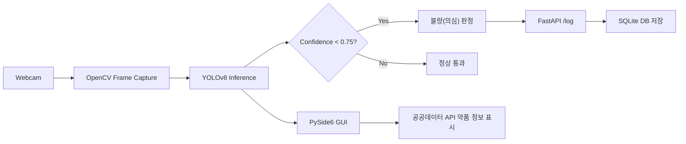

# 💊 PillScanAI

> YOLOv8 기반 실시간 알약 인식 및 스마트팩토리 불량 검수 시스템

PillScanAI는 웹캠으로 촬영한 알약 이미지를 실시간으로 분석해 알약 종류를 분류하고, 신뢰도 기준에 따라 정상/불량 의심 여부를 판단하는 프로젝트입니다.  
감지 결과는 PySide6 GUI에 표시되며, 불량 의심 데이터는 FastAPI 서버를 통해 SQLite 데이터베이스에 기록됩니다.

---

## ✨ 주요 기능

- 🎥 **실시간 객체 탐지**
  - OpenCV로 웹캠 프레임을 수집하고 YOLOv8 모델로 알약을 탐지합니다.
- 🧠 **커스텀 YOLOv8 학습**
  - 직접 구성한 알약 이미지 데이터셋과 Roboflow 기반 데이터셋으로 모델을 학습했습니다.
- 🖥️ **PySide6 데스크톱 GUI**
  - 실시간 영상, 탐지 결과, 약품 상세 정보, 로그를 한 화면에서 확인할 수 있습니다.
- 🏭 **스마트팩토리 검수 흐름**
  - confidence 기준 미만의 감지 결과를 `불량(의심)`으로 분류합니다.
- 🗄️ **FastAPI + SQLite 로그 저장**
  - 불량 의심 알약만 서버로 전송해 DB에 저장합니다.
- 🔎 **공공데이터 API 연동**
  - 식품의약품안전처 의약품 낱알식별정보 API를 통해 실제 약품 정보를 조회합니다.

---

## 🛠️ 기술 스택

| 구분 | 사용 기술 |
| --- | --- |
| Language | Python |
| AI Model | YOLOv8, Ultralytics |
| Computer Vision | OpenCV |
| GUI | PySide6 |
| Backend | FastAPI, Uvicorn |
| Database | SQLite |
| Dataset Tool | Roboflow |
| API | 공공데이터포털 의약품 낱알식별정보 API |

---

## 🏗️ 시스템 구조



---

## 📺 데모 화면

| 실시간 탐지 및 정보 출력 |
| :---: |
|  |

---

## 📁 프로젝트 구조

```text
Pill_Detection/
├── Pill_Detection/
│   ├── train/
│   │   ├── images/          # 학습 이미지
│   │   └── labels/          # YOLO 라벨
│   └── valid/
│       ├── images/          # 검증 이미지
│       └── labels/          # 검증 라벨
├── pill_gui.py              # 실시간 알약 검수 GUI
├── pill_server.py           # FastAPI 로그 저장 서버
├── train_pill.py            # YOLOv8 학습 스크립트
├── webcam_test.py           # 웹캠 추론 테스트
├── test.py                  # 단일 이미지 추론 테스트
├── download_data.py         # Roboflow 데이터셋 다운로드 스크립트
├── pill_factory.db          # SQLite 로그 DB
└── README.md
```

> 참고: `runs/`, `*.pt`, `*.db`는 `.gitignore`에 포함되어 있어 GitHub 업로드 대상에서 제외됩니다.

---

## 🧪 데이터셋

현재 폴더 기준 데이터 구성은 다음과 같습니다.

| Split | Images | Labels |
| --- | ---: | ---: |
| Train | 122 | 44 |
| Valid | 3 | 3 |

탐지 대상 알약 클래스는 다음과 같이 한국어 약품명으로 매핑됩니다.

| Model Label | Korean Name |
| --- | --- |
| Famondine | 파모딘정 |
| Glomipide | 글로미피드정 |
| Loxoprofen | 경보록소프로펜나트륨수화물정 |
| Myoben | 미오벤정 |
| Bronpass | 브론패스정 |
| Cough | 코푸정 |
| Dexidiphen | 덱시디펜정400밀리그램 |
| Eupasidin | 유파시딘에스정 |

---

## 📈 개발 성과

- 🎯 **mAP50 0.995 달성**
  - `runs/detect/pill_final_model8/results.csv` 기준 최종 학습 결과에서 mAP50 0.995를 기록했습니다.
- ⚡ **실시간 검수 흐름 구현**
  - 웹캠 입력부터 AI 추론, GUI 표시, 서버 로그 저장까지 하나의 흐름으로 연결했습니다.
- 🧩 **실무형 기능 결합**
  - 객체 탐지 모델, 공공데이터 API, 데스크톱 GUI, DB 저장 로직을 통합했습니다.

---

## 🚀 실행 방법

### 1. 가상환경 생성 및 패키지 설치

```bash
python -m venv venv
venv\Scripts\activate
pip install ultralytics opencv-python PySide6 fastapi uvicorn requests pydantic roboflow
```

### 2. FastAPI 서버 실행

```bash
python pill_server.py
```

서버 실행 후 기본 주소:

```text
http://127.0.0.1:5000
```

### 3. GUI 실행

```bash
python pill_gui.py
```

GUI에서는 웹캠 화면, YOLO 탐지 결과, 약품 상세 정보, 정상/불량 로그를 확인할 수 있습니다.

### 4. 웹캠 테스트 실행

```bash
python webcam_test.py
```

종료하려면 OpenCV 창에서 `q` 키를 누릅니다.

---

## 🏋️ 모델 학습

학습 스크립트는 `train_pill.py`에서 실행합니다.

```bash
python train_pill.py
```

학습에는 YOLO 형식의 `data.yaml` 파일이 필요합니다.

```yaml
path: ./Pill_Detection
train: train/images
val: valid/images

names:
  0: Famondine
  1: Glomipide
  2: Loxoprofen
  3: Myoben
  4: Bronpass
  5: Cough
  6: Dexidiphen
  7: Eupasidin
```

학습 결과는 기본적으로 `runs/detect/...` 경로에 저장됩니다.

---

## 🗃️ API 명세

### `GET /`

서버 상태 확인용 엔드포인트입니다.

```json
{
  "message": "서버가 정상 작동 중입니다."
}
```

### `POST /log`

불량 의심 알약 정보를 저장합니다.

```json
{
  "line_id": "Line_A_Minki",
  "pill_name": "파모딘정",
  "company": "제약회사명",
  "status": "불량(의심)"
}
```

---

## 👨‍💻 기여도 및 역할

- 🧠 **모델 설계 및 학습**
  - YOLOv8n 기반 커스텀 탐지 모델 학습 및 하이퍼파라미터 조정
- 🧪 **데이터셋 구성**
  - 알약 이미지 수집, YOLO 라벨 구성, Roboflow 데이터셋 활용
- 🖥️ **GUI 애플리케이션 개발**
  - PySide6와 QThread를 활용해 실시간 영상 처리 중 UI 응답성을 유지
- 🔌 **API 통합**
  - 공공데이터 API 조회 및 FastAPI 서버 로그 저장 로직 구현
- 🗄️ **DB 설계**
  - SQLite 기반 불량 의심 로그 테이블 구성

---

## 📌 핵심 포인트

- ✅ 단순 이미지 분류가 아닌 **실시간 객체 탐지 시스템** 구현
- ✅ AI 모델, GUI, 서버, 데이터베이스를 연결한 **엔드투엔드 프로젝트**
- ✅ 제조 현장의 품질 검수 시나리오를 반영한 **스마트팩토리 응용 사례**
- ✅ 공공데이터 API를 활용해 탐지 결과에 **실제 약품 정보**를 결합
- ✅ 정상 데이터는 제외하고 불량 의심 데이터만 저장하는 **업무 로직 설계**

---

## 🔮 개선 방향

- 📊 관리자용 대시보드 추가
- 📷 이미지 업로드 기반 검사 기능 추가
- 🧪 테스트 코드 및 API 문서 자동화
- 🧩 모델 경로, 임계값, API 키를 설정 파일로 분리
- 🚢 Docker 기반 실행 환경 구성
- ⚙️ Jetson Nano 등 엣지 디바이스 배포를 위한 TensorRT 최적화

---

## 👤 제작자

스마트팩토리 환경에서 사용할 수 있는 알약 검수 자동화 시스템을 목표로 제작한 AI 비전 프로젝트입니다.
